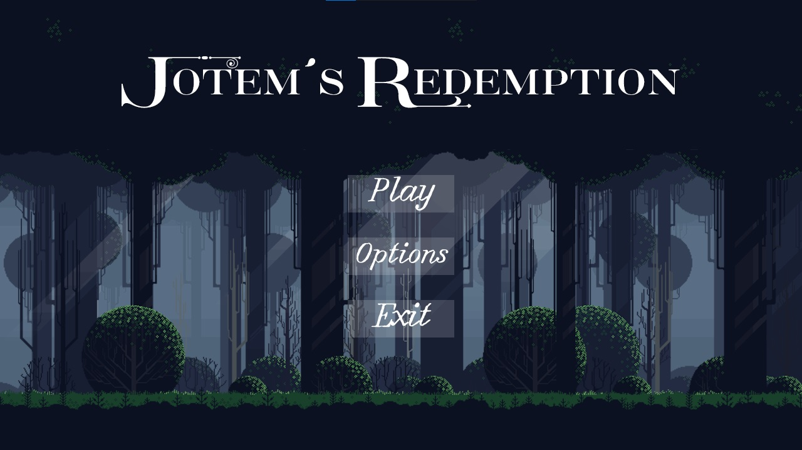

# Jotem's Redemption

<div align="center">
  


[](https://www.python.org/)
[](https://www.pygame.org/)
[](LICENSE)
[](https://github.com/tuusuario/jotems-redemption)

**Un épico videojuego 2D de aventuras y fantasía**

_En la oscuridad de tu culpa, solo el valor en el combate puede devolverte la luz_

</div>

---

## 🎮 Descripción del Juego

**Jotem's Redemption** es un videojuego 2D de aventuras ambientado en un mundo de fantasía oscura, desarrollado completamente en **Python** utilizando **Pygame**.

En este juego encarnas a un valiente guerrero que debe enfrentarse a enemigos desafiantes mientras explora diversos escenarios llenos de peligros y secretos. Con un estilo visual de **pixel art** cuidadosamente diseñado, cada nivel ofrece una experiencia única que combina acción, estrategia y exploración.

### 🌟 Características principales

- 🎨 **Arte pixel perfecto** con animaciones fluidas y detalladas
- ⚔️ **Sistema de combate dinámico** con diferentes tipos de enemigos
- 🗺️ **Múltiples escenarios** con ambientaciones únicas
- 🎵 **Banda sonora inmersiva** que acompaña la aventura
- 🏃‍♂️ **Mecánicas de movimiento** precisas y responsivas
- 📖 **Historia envolvente** con elementos de fantasía oscura

---

## 📷 Capturas de pantalla

|  |  |

---

## 🛠️ Tecnologías Utilizadas

- **🐍 Python 3.8+** - Lenguaje principal de desarrollo
- **🎮 Pygame 2.0+** - Framework para desarrollo de juegos 2D
- **🔊 Audio Processing** - Manejo de efectos de sonido y música

---

## 🚀 Instalación y Ejecución

### Prerrequisitos

Asegurate de tener instalado:

- Python 3.8 o superior
- pip (administrador de paquetes de Python)

### Pasos de instalación

```bash
# 1. Clonar el repositorio
git clone https://github.com/tomasrome/jotems-redemption-project

# 2. Navegar al directorio del proyecto
cd jotems-redemption-project

# 3. Instalar requerimientos
pip install -r requirements.txt

# 4. Ejecutar el juego
python main.py
```

### Instalación rápida

```bash
# Instalación directa de pygame
pip install pygame

# Ejecutar el juego
python main.py
```

---

## 🎯 Controles del Juego

| Acción              | Tecla     |
| ------------------- | --------- |
| **Mover izquierda** | `A`       |
| **Mover derecha**   | `D`       |
| **Saltar**          | `W`       |
| **Atacar**          | `Espacio` |
| **Pausar**          | `Esc`     |

---

## 🔄 Estado del Desarrollo

- [x] ⚔️ Sistema básico de combate
- [x] 🏃‍♂️ Mecánicas de movimiento del jugador
- [x] 🎵 Integración de audio
- [ ] 👹 IA básica de enemigos
- [ ] 🗺️ Sistema de niveles
- [ ] 🎒 Sistema de inventario completo
- [ ] 🏆 Sistema de logros
- [ ] 💾 Sistema de guardado

---

## 📄 Licencia

Este proyecto está bajo la Licencia MIT. Ver el archivo [LICENSE](LICENSE) para más detalles.

---

## 📬 Contacto

**Desarrollador:** Tomás Romero

- 📧 **Email:** [tomasrom.dev@gmail.com](mailto:tomasrom.dev@gmail.com)
- 💼 **LinkedIn:** [tomas-romero-developer](https://www.linkedin.com/in/tomas-romero-developer)
- 🐙 **GitHub:** [@tomasrome](https://github.com/tomasrome)
- 🌐 **Portfolio:** [tomasrome.github.io](https://tomasrome.github.io)

---

<div align="center">

**¿Te gusta el proyecto? ¡Dale una ⭐ al repositorio!**

_Desarrollado con ❤️ y mucho ☕ por [Tomás Romero](https://github.com/tomasrome)_


</div>
